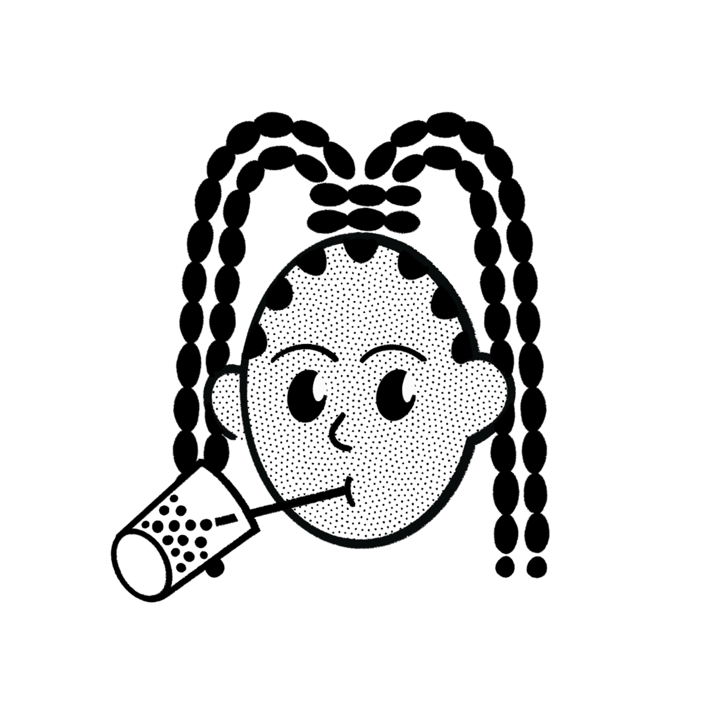
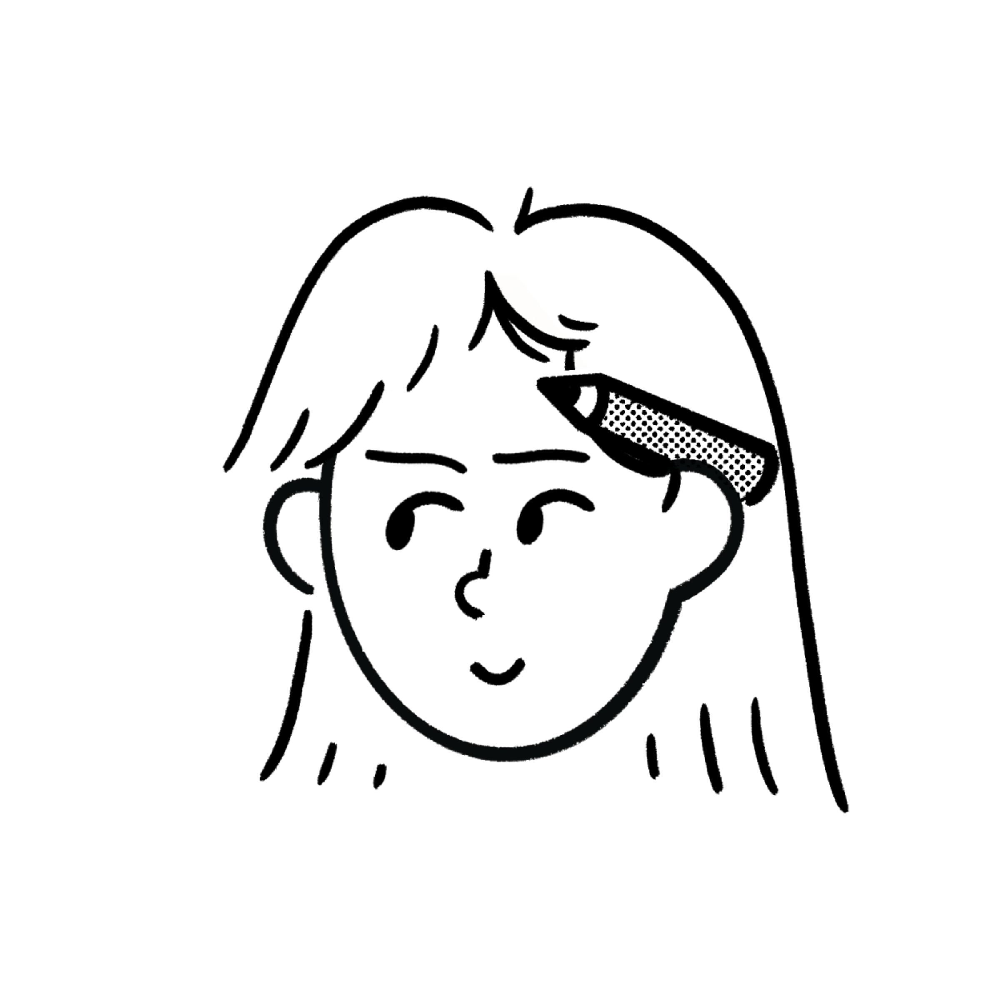

# 🌟 **DONT WORRY** 🌟

> **나만의 걱정 고민을 들어주고 도와주는 AI 서비스로, 작성한 고민에 대해 분석하고 도움을 줍니다**  
> 나의 걱정거리들을 기록하고 나중에 봤을 때 내가 어떤 걱정을 가지고 있었는지 확인할 수 있는 혁신적인 서비스! 😊

---

### 🚀 **서비스 기능**  
✅ **홈 화면 (소개 페이지)** - 서비스에 대한 전반적인 소개와 이용 방법을 볼 수 있습니다.  
✏️ **걱정 작성 페이지** - 사용자가 걱정거리를 작성하고, AI로부터 위로의 답변을 받을 수 있습니다.  
📥 **걱정 보관함** - 사용자가 작성한 내용과 답변은 걱정 보관함에서 다시 확인할 수 있습니다.  
📊 **걱정 분석 (통계 페이지)** - 작성한 걱정들을 분석하여, 반복해서 기록한 고민을 도표로 확인할 수 있습니다.  
💌 **미래의 나에게 보내는 편지** - 미래의 나에게 보내는 편지를 통해 과거의 자신과 현재의 자신이 얼마나 달라졌는지 확인해보세요.

> 언제나, 평생 나의 편인 친구, **Don't worry**!

👉 [**프로젝트 URL 바로가기** 💻](https://dontworry.io.kr/)

---

## 📄 **프로젝트 소개**

**📆 프로젝트 기간**: 2025.03.31 ~ 2025.04.27

### 🗺️ **Don't worry** 한 줄 소개

"여러분의 걱정을 담아내고, 따뜻한 말 한마디로 마음을 토닥여주는 작은 친구예요."  
고민이 많은 현대인들을 위한 든든한 지원군의 등장. 이제 **Don't worry**와 함께 자신만의 걱정거리를 이야기해보세요!

---

## 🚀 **주요 기능**  

### **기능1**  
✅ 걱정 주제와 감정을 기반으로 모든 고민에 대한 조언 제공  
✅ 작성한 고민들을 걱정 보관함에서 열람 가능  

### **기능2**  
✅ 마이페이지에서 이전에 작성한 걱정 내역을 수치상으로 확인 가능  

### **기능3**  
✅ 미래의 나에게 편지를 작성하여 이메일 형식으로 받아보기 가능  

### **기능4**  
✅ 작성한 걱정들을 주/월 단위로 분석하여 도식화한 차트 제공  
✅ 분석한 고민을 기반으로 위로의 한마디와 조언 제공  
✅ 이전 월/주 대비 많이 감소한 고민과 증가한 고민에 대한 분석 제공

---

## 💻 **사용 기술**

### **Environment**
  
  
  
  
  
  
  

### **Record**  
  

### **Deploy**  

---

## ⚙️ **프로젝트 기능 상세**

- Next.js로 구성된 프로젝트입니다.
- 한국어를 제공합니다.
- Supabase를 활용하여 데이터베이스를 구축했습니다.
- `react-hook-form` 라이브러리를 사용하여 사용자 input을 효율적으로 관리합니다.

---

## 🫂 **팀 구성**

<table>
  <tbody>
    <tr>
     <!-- 송제우 -->
      <td align="center">
        
         
        <b>송제우</b>
         
        
          <a href="https://github.com/PomegranateBlue">깃허브</a> /
          <a href="https://velog.io/@wpdn98/posts">블로그</a>
        
      </td>
      <!-- 오원택 -->
      <td align="center">
        
         
        <b>오원택</b>
         
        
          <a href="https://github.com/dhdnjs0702">깃허브</a> /
          <a href="https://ihatecoding3636.tistory.com/">블로그</a>
        
      </td>
      <!-- 유익환 -->
      <td align="center">
        
         
        <b>유익환</b>
         
        
          <a href="https://github.com/ick-web/">깃허브</a> /
          <a href="https://devyu0001.tistory.com/">블로그</a>
        
      </td>
      <!-- 문정빈 -->
      <td align="center">
        
         
        <b>문정빈</b>
         
        
          <a href="https://github.com/answq">깃허브</a> /
          <a href="https://blog.naver.com/answq_">블로그</a>
        
      </td>
      <!-- 강혜린 -->
      <td align="center">
        
         
        <b>강혜린</b>
         
        
          <a href="https://github.com/hyerin-kang">깃허브</a> /
          <a href="https://rinny01.tistory.com/">블로그</a>
        
      </td>
    </tr>
    <tr>
      <td width="300px" align="center">소개/작성/보관함</td>
      <td width="300px" align="center">통계 페이지</td>
      <td width="300px" align="center">마이페이지</td>
      <td width="300px" align="center">편지 쓰기/보관함</td>
      <td width="300px" align="center">로그인/회원가입</td>
    </tr>
  </tbody>
</table>

---

## 🧑‍💻 **트러블 슈팅 & 작업 후기**

- [트러블 슈팅 #1](https://www.notion.so/teamsparta/setUser-1d12dc3ef5148048abe4ef5406b188d1)
- [트러블 슈팅 #2](https://teamsparta.notion.site/42501-rls-1-1d22dc3ef514805caa7bd6f70e6497b3)
- [트러블 슈팅 #3](https://teamsparta.notion.site/store-1d32dc3ef5148033ac68df5d221ec461)
- [트러블 슈팅 #4](https://teamsparta.notion.site/1d62dc3ef51480b9aa2bd9d0c947fd22)
